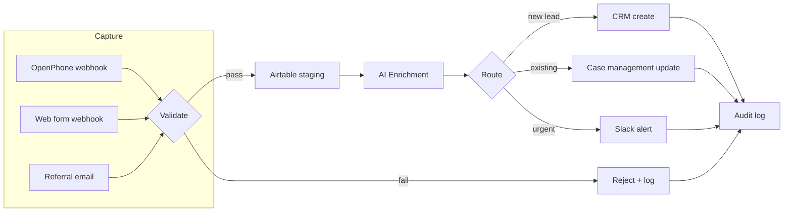

# n8n-legal-ops-templates

> Production-grade n8n workflow templates for law firm operations — client intake, missed call recovery, billing sync, and case routing. Generic patterns using fictional "Greenfield & Associates" — zero real client data.

**Tested on:** n8n v1.x.x | **License:** MIT | **Status:** Active

> **Disclaimer:** These templates provide workflow logic patterns only — not legal advice. All decision-making workflows include human review gates. Consult your bar association's rules before automating legal processes.

---

## What It Does

Reusable n8n workflow templates for common law firm operations:

- **Client intake pipeline** — webhook capture → validate → classify → route to CRM
- **Missed call recovery** — OpenPhone webhook → AI classify → SMS follow-up
- **Billing sync** — case management → billing system with conflict resolution
- **Case routing** — AI-powered case type classification → attorney assignment

All workflows use the error handling patterns from [n8n-error-handling-pattern](https://github.com/lorenzespinosa/n8n-error-handling-pattern).

## System Architecture

## Workflows

| File | Template | Description |
|------|----------|-------------|
| *(coming in v0.2.0)* | — | — |

All sample payloads use fictional "Greenfield & Associates" — a made-up personal injury firm. Phone numbers use 555-format, case IDs use `matter_99999` pattern.

## How to Import

1. Download any workflow JSON from the `workflows/` directory
2. In n8n: **Settings → Workflow Templates → Import from file**
3. Configure credential placeholders (documented per workflow)
4. Import error handling sub-workflows from [n8n-error-handling-pattern](https://github.com/lorenzespinosa/n8n-error-handling-pattern)
5. Set `active: true` only after testing with sample payloads from `payloads/`

## Multi-Platform

| Platform | Coverage |
|----------|---------|
| n8n | Full workflow JSON (importable) |
| Make | `docs/make-equivalent.md` — conceptual rebuild guide |
| Zapier | `docs/zapier-equivalent.md` — conceptual rebuild guide |

## Business Impact

*(Coming in v0.2.0 — intake time reduction, billing accuracy metrics)*

## Contributing

See [CONTRIBUTING.md](./CONTRIBUTING.md). All contributions require the pre-submit checklist. Extra emphasis: no real PII, human review gates on all decision workflows.

## License

[MIT](./LICENSE) © 2024 Lorenz Espinosa
