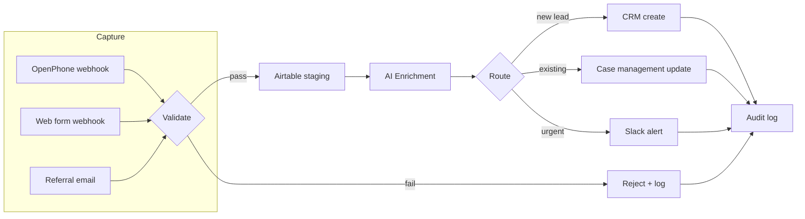

# n8n-legal-ops-templates

> Production-grade n8n workflow templates for law firm operations — client intake, missed call recovery, billing sync, and case routing. Generic patterns using fictional "Greenfield & Associates" — zero real client data.

**Tested on:** n8n v1.x.x | **License:** MIT | **Status:** Active

> **Disclaimer:** These templates provide workflow logic patterns only — not legal advice. All decision-making workflows include human review gates. Consult your bar association's rules before automating legal processes.

---

## What It Does

Reusable n8n workflow templates for common law firm operations:

- **Client intake pipeline** — webhook capture → validate → classify → route to CRM
- **Missed call recovery** — OpenPhone webhook → AI classify → SMS follow-up
- **Billing sync** — case management → billing system with conflict resolution
- **Case routing** — AI-powered case type classification → attorney assignment

All workflows use the error handling patterns from [n8n-error-handling-pattern](https://github.com/lorenzespinosa/n8n-error-handling-pattern).

## System Architecture


```mermaid
flowchart LR
    subgraph Capture
        A1[OpenPhone webhook] --> V
        A2[Web form webhook] --> V
        A3[Referral email] --> V
    end

    V{Validate} -->|pass| S[Airtable staging]
    V -->|fail| REJ[Reject + log]

    S --> AI[AI Enrichment]
    AI --> R{Route}
    R -->|new lead| CRM[CRM create]
    R -->|existing| CM[Case management update]
    R -->|urgent| ALERT[Slack alert]

    CRM --> LOG[Audit log]
    CM --> LOG
    ALERT --> LOG
    REJ --> LOG
```

## Workflows

| File | Template | Description |
|------|----------|-------------|
| `client-intake-pipeline.json` | Client Intake | Webhook → validate → AI classify → human review → CRM create |
| `missed-call-recovery.json` | Missed Call Recovery | OpenPhone webhook → TCPA check → human review → SMS follow-up |
| `billing-sync.json` | Billing Sync | Schedule → fetch unbilled → format → conflict check → billing create |
| `case-routing.json` | Case Routing | Webhook → AI classify + urgency → human review → attorney assign |

All sample payloads use fictional "Greenfield & Associates" — a made-up personal injury firm. Phone numbers use 555-format, case IDs use `matter_99999` pattern.

## How to Import

1. Download any workflow JSON from the `workflows/` directory
2. In n8n: **Settings → Workflow Templates → Import from file**
3. Configure credential placeholders (documented per workflow)
4. Import error handling sub-workflows from [n8n-error-handling-pattern](https://github.com/lorenzespinosa/n8n-error-handling-pattern)
5. Set `active: true` only after testing with sample payloads from `payloads/`

## Multi-Platform

| Platform | Coverage |
|----------|---------|
| n8n | Full workflow JSON (importable) |
| Make | `docs/make-equivalent.md` — conceptual rebuild guide |
| Zapier | `docs/zapier-equivalent.md` — conceptual rebuild guide |

## Business Impact

*(Coming in v0.2.0 — intake time reduction, billing accuracy metrics)*

## Contributing

See [CONTRIBUTING.md](./CONTRIBUTING.md). All contributions require the pre-submit checklist. Extra emphasis: no real PII, human review gates on all decision workflows.

## License

[MIT](./LICENSE) © 2024 Lorenz Espinosa

---

## Quick Start

```bash
# Clone and explore
git clone https://github.com/lorenzespinosa/n8n-legal-ops-templates.git
cd n8n-legal-ops-templates

# Import workflows into n8n
# 1. First import error handling patterns from n8n-error-handling-pattern
# 2. Then import legal ops workflows from workflows/
# 3. Configure credential placeholders
# 4. Test with Greenfield & Associates sample payloads from payloads/
```

## Related Projects

- [n8n-error-handling-pattern](https://github.com/lorenzespinosa/n8n-error-handling-pattern) — Error handling sub-workflows imported by these templates
- [n8n-ai-agent-delegator](https://github.com/lorenzespinosa/n8n-ai-agent-delegator) — Multi-agent AI system that can integrate with these legal ops workflows

---

<!-- hire-cta -->
## 👋 Built by Lorenz Espinosa

I design and ship production automation for ops-heavy businesses — webhook-driven, AI-powered systems with validation, retries, and audit logging baked in. **50+ processes automated · $800K+ saved.**

**Want something like this built for your team?**

[](https://github.com/lorenzespinosa) &nbsp;[](mailto:renzespinosa13@gmail.com?subject=Automation%20project%20inquiry&body=Hi%20Lorenz%2C%0A%0AGoal%3A%0ASystems%2Ftools%20involved%3A%0ATimeline%3A%0A) &nbsp;[](https://www.linkedin.com/in/lorenz-leslie-espinosa/)
