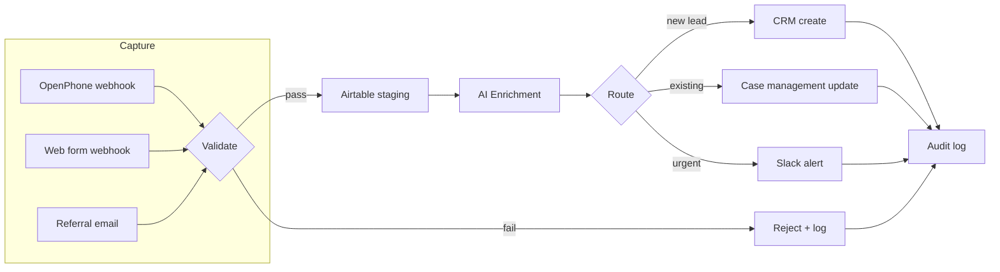

# n8n-legal-ops-templates

> Fictional-data examples for legal-operations handoffs. The historical templates in `workflows/` are not deployment-ready. The separately tested client-intake sandbox lives in `runtime/demo/`; see `docs/case-study.md` for evidence and limits.

**Tested sandbox:** n8n 2.37.10, digest-pinned, local mocks | **Historical templates:** examples, not runtime-accepted | **License:** MIT

> **Safety note:** This repository is not legal advice or a production integration. The historical intake graph queues a review request but does not require approval before its CRM node. Do not activate the historical templates with real records or connect live services on the strength of this README. The tested sandbox uses fictional records, a test-simulated reviewer action, and a mock CRM.

---

## Tested client-intake sandbox

The new implementation has separate `intake-stage`, `reviewer-decision`, and `approved-delivery` n8n graphs. Intake validates and stages a fictional record; a separately recorded, **test-simulated** reviewer decision must authorize delivery. The mock CRM counts write attempts and committed effects independently. On pinned n8n 2.37.10, five case groups passed: the unapproved and rejected paths made zero CRM attempts; approved delivery made one attempt and one committed effect; the pre-commit failure/retry case made two attempts and one effect. These are local engineering results, not a client outcome or a production guarantee.

From the repository root, with Docker running and the pinned image already cached:

```bash
./runtime/run-gated-demo.sh
./runtime/run-clean-rerun.sh
node runtime/scripts/final-evidence.mjs verify runtime/evidence/final-evidence-log.json
```

The clean rerun is **verification-only**: it compares a new test run against the accepted record and discards its candidate. It does not rewrite the committed evidence or the buyer documents. `./runtime/run-final-evidence.sh` is a separate, explicit republishing action; a new accepted record would require the case study and excerpt to be reviewed and realigned. Read `runtime/README.md`, `docs/case-study.md`, and `docs/evidence-summary.md` before using any result. Automated approvals are simulated reviewer input; proof reuse after a privileged reset, disk-backed fictional mock state, and untested failure modes are disclosed in the case study. No external service or live account is contacted by the sandbox.

## Historical template index — inspection only

The four original JSON files under `workflows/` are preserved for inspection. They contain real external-service URLs with placeholder identifiers and missing credential bindings; importing and configuring them can attempt external calls. They have not been accepted as working, approval-gated deployments on the pinned runtime. The original intake webhook returned HTTP 400 unchanged; only a narrowly adapted local runtime copy reached HTTP 202 and exposed an ungated mock CRM write. Do not mistake the historical files for the tested three-graph sandbox.

## What it does

Historical n8n examples for common law-firm operations:

- **Client intake pipeline** — webhook capture → validate → classify → route to CRM
- **Missed call recovery** — OpenPhone webhook → AI classify → SMS follow-up
- **Billing sync** — case management → billing system with conflict detection and a manual-review queue
- **Case routing** — AI-powered case type classification → attorney assignment

The historical examples refer to [n8n-error-handling-pattern](https://github.com/lorenzespinosa/n8n-error-handling-pattern). Inspect each graph and its error paths independently before adapting it.

## Historical conceptual architecture (not an approval-gated implementation)

This diagram sketches the older single-graph flow. It is **not** the tested sandbox's three-graph architecture; the old path to CRM does not wait for an approval decision.


```mermaid
flowchart LR
    subgraph Capture
        A1[OpenPhone webhook] --> V
        A2[Web form webhook] --> V
        A3[Referral email] --> V
    end

    V{Validate} -->|pass| S[Airtable staging]
    V -->|fail| REJ[Reject + log]

    S --> AI[AI Enrichment]
    AI --> R{Route}
    R -->|new lead| CRM[CRM create]
    R -->|existing| CM[Case management update]
    R -->|urgent| ALERT[Slack alert]

    CRM --> LOG[Audit log]
    CM --> LOG
    ALERT --> LOG
    REJ --> LOG
```

## Original workflow files

Four historical JSON examples live in `workflows/`. They are not self-contained deployments: external-service URLs are real, while identifiers and credential bindings are placeholders. Approval and error behavior must be audited rather than inferred from sticky notes or generic retry settings. For a measured client-intake gate, use the separate local sandbox above.

---

### 1. Client Intake Pipeline — `client-intake-pipeline.json`

- **What it does:** Captures an intake form submission, validates required
  fields, normalizes the phone to E.164, deduplicates against existing
  contacts, runs AI case-type classification, and queues a review request. The
  queue has no approval consumer in this repository; the graph proceeds toward
  its CRM node without a recorded reviewer decision. Do not deploy this file.
- **Trigger:** Webhook (`POST` to path `intake-webhook`).
- **Key nodes:** Webhook · Code (validate/normalize) · IF (dedupe + routing) ·
  HTTP Request (Airtable dedupe lookup, AI classify, review-queue write,
  Lawmatics CRM create, Slack alert) · Respond to Webhook.
- **Credentials (by type):** HTTP Header Auth — one credential per downstream
  service (Airtable, the AI provider, Slack, Lawmatics/your CRM).
- **Sample payload:** `payloads/intake-new-lead.json`.

### 2. Missed Call Recovery — `missed-call-recovery.json`

- **What the historical graph attempts:** Receives an OpenPhone missed-call
  webhook, extracts caller info, runs AI intent classification, and writes to a
  review queue. If configured and activated, that queue node flows directly to
  an OpenPhone SMS-send request; there is **no approval consumer or condition**
  between them. This is not safe to use for real messaging. Failure paths and
  non-missed calls can terminate without an audit-log write.
- **Trigger:** Webhook (`POST` to path `missed-call-webhook`).
- **Key nodes:** Webhook · Code (extract/classify prep) · IF (call-type
  routing) · HTTP Request (AI classify, Airtable review queue + logging,
  OpenPhone SMS send).
- **Credentials (by type):** HTTP Header Auth — for the AI provider, Airtable,
  and OpenPhone.
- **Sample payload:** `payloads/missed-call-webhook.json`.
- **Note:** The historical graph does **not** implement SMS approval. Do not
  connect it to a real messaging account. Any adapted send path needs its own
  tested authorization and independent review of applicable consent rules.

### 3. Billing Sync — `billing-sync.json`

- **What the historical graph attempts:** On a weekday schedule, pulls
  unbilled time, maps records, and queues entries with missing matter IDs or
  non-positive hours for manual review and a Slack alert. Other records can
  proceed to the Clio request. The executable check does **not** detect
  duplicate matter IDs or guarantee idempotency; do not use it for live billing.
- **Trigger:** Schedule (cron `0 6 * * 1-5` — 06:00, Mon–Fri).
- **Key nodes:** Schedule Trigger · Code (transform/batch) · IF (conflict
  split) · HTTP Request (Filevine fetch, Clio create, Airtable conflict queue +
  audit log, Slack alert).
- **Credentials (by type):** HTTP Header Auth — for the case management API
  (e.g. Filevine), the billing API (e.g. Clio), Airtable, and Slack.
- **Sample payload:** `payloads/billing-sync-batch.json`.

### 4. Case Routing — `case-routing.json`

- **What it illustrates:** Validates an inbound case webhook, runs AI case-type
  classification plus an urgency score, queues a review request, then sketches
  assignment and notification paths. A queue write alone is not proof that a
  human approval gates those paths; this graph was not accepted as a tested
  approval-gated deployment.
- **Trigger:** Webhook (`POST` to path `case-routing-webhook`).
- **Key nodes:** Webhook · Code (validate, build assignment) · IF / Switch
  (route by `case_type`) · HTTP Request (AI classify, Airtable review queue +
  audit log, attorney-assignment writes, Slack notify) · Respond to Webhook.
- **Credentials (by type):** HTTP Header Auth — for the AI provider, Airtable,
  your assignment system, and Slack.
- **Sample payload:** `payloads/case-routing-result.json`.

> Bundled sample payloads use the fictional firm "Greenfield & Associates".
> Keep real client names, matter details, credentials, and contact data out of
> this repository and the local demo.

## How to inspect safely

1. Read the [case study](docs/case-study.md) and [runtime guide](runtime/README.md) for the tested, fictional client-intake sandbox. Run its local acceptance suite only with the cached pinned image and no real records or accounts.
2. Treat `workflows/` as historical source. Review each JSON graph and its external endpoints offline; the old client-intake file's review queue does not prevent the CRM path. Do not import or activate these examples in a live environment.
3. [n8n-lint](https://github.com/lorenzespinosa/n8n-lint) can help inspect workflow JSON, but a structural lint result is not proof of a runtime approval gate, valid credentials, reliable retry behavior, or safe deployment.
4. Before adapting any pattern for a real system, design and test its authorization, consent, idempotency, failure recovery, data custody, and human operating procedure for that system. None of those production checks is supplied by this demo.

## Multi-Platform

| Platform | Coverage |
|----------|---------|
| n8n | Historical JSON examples for inspection; separate locally tested intake sandbox |
| Make | `docs/make-equivalent.md` — conceptual rebuild guide |
| Zapier | `docs/zapier-equivalent.md` — conceptual rebuild guide |

## Results and limits

This repository contains counted **mock** CRM attempts/effects and test verdicts, not measured savings, intake-time reduction, billing accuracy, or a live client outcome. See [evidence summary](docs/evidence-summary.md) for the actual local counts and limitations.

## Contributing

See [CONTRIBUTING.md](./CONTRIBUTING.md). Keep real client data out of contributions. Changes to the tested sandbox must preserve and re-test its recorded approval boundary; the historical templates are not certified as human-gated.

## License

[MIT](./LICENSE) © 2024 Lorenz Espinosa

---

## Quick start for the fictional sandbox

Read `docs/case-study.md`, then run `./runtime/run-gated-demo.sh` from a local checkout with Docker running and the pinned n8n image cached. This runs only against fictional local mocks and removes its owned containers after the tests. The historical `workflows/` files are not the tested implementation.

## Related Projects

- [n8n-error-handling-pattern](https://github.com/lorenzespinosa/n8n-error-handling-pattern) — Reference patterns for designing error handling; not imported by the historical JSON files
- [n8n-ai-agent-delegator](https://github.com/lorenzespinosa/n8n-ai-agent-delegator) — Separate experimental project; no integration with these historical templates is verified here

---

<!-- hire-cta -->
## Built by Lorenz Espinosa

I help teams connect the tools they already use, with validation, review points, documentation, and support. The case study above is a fictional-data engineering test, not a client's results. For a first inquiry, send a general description of the process and tools; please omit client names and confidential details.

**Want something like this built for your team?**

[](https://github.com/lorenzespinosa) &nbsp;[](mailto:renzespinosa13@gmail.com?subject=Automation%20project%20inquiry&body=Hi%20Lorenz%2C%0A%0AGoal%3A%0ASystems%2Ftools%20involved%3A%0ATimeline%3A%0A) &nbsp;[](https://www.linkedin.com/in/lorenz-leslie-espinosa/)
