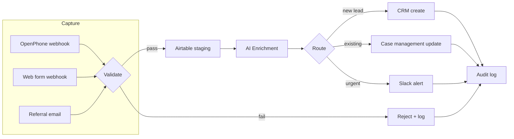

# n8n-legal-ops-templates

> Production-grade n8n workflow templates for law firm operations — client intake, missed call recovery, billing sync, and case routing. Generic patterns using fictional "Greenfield & Associates" — zero real client data.

**Tested on:** n8n v1.x.x | **License:** MIT | **Status:** Active

> **Disclaimer:** These templates provide workflow logic patterns only — not legal advice. All decision-making workflows include human review gates. Consult your bar association's rules before automating legal processes.

---

## What It Does

Reusable n8n workflow templates for common law firm operations:

- **Client intake pipeline** — webhook capture → validate → classify → route to CRM
- **Missed call recovery** — OpenPhone webhook → AI classify → SMS follow-up
- **Billing sync** — case management → billing system with conflict resolution
- **Case routing** — AI-powered case type classification → attorney assignment

All workflows use the error handling patterns from [n8n-error-handling-pattern](https://github.com/lorenzespinosa/n8n-error-handling-pattern).

## System Architecture


```mermaid
flowchart LR
    subgraph Capture
        A1[OpenPhone webhook] --> V
        A2[Web form webhook] --> V
        A3[Referral email] --> V
    end

    V{Validate} -->|pass| S[Airtable staging]
    V -->|fail| REJ[Reject + log]

    S --> AI[AI Enrichment]
    AI --> R{Route}
    R -->|new lead| CRM[CRM create]
    R -->|existing| CM[Case management update]
    R -->|urgent| ALERT[Slack alert]

    CRM --> LOG[Audit log]
    CM --> LOG
    ALERT --> LOG
    REJ --> LOG
```

## Template Index

Four importable workflows live in `workflows/`. Each is self-contained, uses
HTTP Request nodes (so it works with any CRM/billing/case API you point it at),
and ships with inline sticky-note docs inside the canvas.

Every HTTP Request node is configured with `retryOnFail` (3 tries, 5s backoff)
and `onError: stopWorkflow`, so transient API failures retry and hard failures
surface to your error workflow instead of being swallowed.

---

### 1. Client Intake Pipeline — `client-intake-pipeline.json`

- **What it does:** Captures an intake form submission, validates required
  fields, normalizes the phone to E.164, deduplicates against existing
  contacts, runs AI case-type classification, then queues the lead for human
  review before any CRM write. Urgent cases fire a Slack alert.
- **Trigger:** Webhook (`POST` to path `intake-webhook`).
- **Key nodes:** Webhook · Code (validate/normalize) · IF (dedupe + routing) ·
  HTTP Request (Airtable dedupe lookup, AI classify, review-queue write,
  Lawmatics CRM create, Slack alert) · Respond to Webhook.
- **Credentials (by type):** HTTP Header Auth — one credential per downstream
  service (Airtable, the AI provider, Slack, Lawmatics/your CRM).
- **Sample payload:** `payloads/intake-new-lead.json`.

### 2. Missed Call Recovery — `missed-call-recovery.json`

- **What it does:** Receives an OpenPhone missed-call webhook, extracts caller
  info, runs AI intent classification (new client / existing / solicitor /
  unknown), and queues a proposed SMS follow-up for human approval. All calls
  are logged regardless of outcome; non-client calls log and exit.
- **Trigger:** Webhook (`POST` to path `missed-call-webhook`).
- **Key nodes:** Webhook · Code (extract/classify prep) · IF (call-type
  routing) · HTTP Request (AI classify, Airtable review queue + logging,
  OpenPhone SMS send).
- **Credentials (by type):** HTTP Header Auth — for the AI provider, Airtable,
  and OpenPhone.
- **Sample payload:** `payloads/missed-call-webhook.json`.
- **Note:** SMS is *not* sent automatically — a separate approval step (n8n
  follow-up workflow or Airtable automation) triggers the actual send after a
  coordinator signs off. Confirm TCPA/consent rules before any outbound SMS.

### 3. Billing Sync — `billing-sync.json`

- **What it does:** On a weekday schedule, pulls unbilled time from the case
  management system, maps records to the billing API's shape, strips null
  values, routes conflicts (zero/negative hours, missing matter IDs,
  duplicates) to a manual-review queue with a Slack alert, and syncs valid
  records in batches.
- **Trigger:** Schedule (cron `0 6 * * 1-5` — 06:00, Mon–Fri).
- **Key nodes:** Schedule Trigger · Code (transform/batch) · IF (conflict
  split) · HTTP Request (Filevine fetch, Clio create, Airtable conflict queue +
  audit log, Slack alert).
- **Credentials (by type):** HTTP Header Auth — for the case management API
  (e.g. Filevine), the billing API (e.g. Clio), Airtable, and Slack.
- **Sample payload:** `payloads/billing-sync-batch.json`.

### 4. Case Routing — `case-routing.json`

- **What it does:** Validates an inbound case webhook, runs AI case-type
  classification plus an urgency score, gates the result through a human review
  queue, then routes by case type via a Switch node to the assigned attorney,
  notifies Slack, and audit-logs the assignment.
- **Trigger:** Webhook (`POST` to path `case-routing-webhook`).
- **Key nodes:** Webhook · Code (validate, build assignment) · IF / Switch
  (route by `case_type`) · HTTP Request (AI classify, Airtable review queue +
  audit log, attorney-assignment writes, Slack notify) · Respond to Webhook.
- **Credentials (by type):** HTTP Header Auth — for the AI provider, Airtable,
  your assignment system, and Slack.
- **Sample payload:** `payloads/case-routing-result.json`.

> All sample payloads use the fictional firm "Greenfield & Associates" — a
> made-up personal injury practice. Phone numbers use 555-format, case IDs use
> the `matter_99999` pattern. **Zero real client data.**

## How to use these templates

1. **Import the workflow.** In n8n: **Workflows → Import from File** and select a
   JSON from `workflows/`. (Or paste the JSON via **Import from URL/Clipboard**.)
2. **Create credentials.** Each workflow uses **HTTP Header Auth** credentials —
   one per downstream service. In n8n, create an HTTP Header Auth credential
   (e.g. header `Authorization: Bearer <token>`) for each API the workflow
   calls, then select it on the matching HTTP Request node. No secrets are
   stored in the JSON; credentials are referenced by type only.
3. **Set the webhook URL / schedule.** For webhook-triggered workflows, copy the
   generated production webhook URL into the upstream system (intake form,
   OpenPhone, etc.). For Billing Sync, adjust the cron in the Schedule Trigger.
4. **Wire your error workflow.** These templates assume the sub-workflows from
   [n8n-error-handling-pattern](https://github.com/lorenzespinosa/n8n-error-handling-pattern).
   Set it under **Workflow Settings → Error Workflow** so hard failures (after
   retries) are captured.
5. **Test with sample payloads.** Send the matching file from `payloads/` to the
   webhook (or pin it as test data) and confirm the flow before going live.
6. **Activate.** Only set the workflow active after a successful test run. Keep
   the human-review gates in place — every decision workflow here is designed to
   require sign-off before a write.

> **Validate before importing:** these templates pass
> [n8n-lint](https://github.com/lorenzespinosa/n8n-lint) with zero issues (no
> `meta.instanceId`, no leaked credentials, error handling on every HTTP node).
> Run `npx n8n-lint workflows/` to re-check after you edit them.

## Multi-Platform

| Platform | Coverage |
|----------|---------|
| n8n | Full workflow JSON (importable) |
| Make | `docs/make-equivalent.md` — conceptual rebuild guide |
| Zapier | `docs/zapier-equivalent.md` — conceptual rebuild guide |

## Business Impact

*(Coming in v0.2.0 — intake time reduction, billing accuracy metrics)*

## Contributing

See [CONTRIBUTING.md](./CONTRIBUTING.md). All contributions require the pre-submit checklist. Extra emphasis: no real PII, human review gates on all decision workflows.

## License

[MIT](./LICENSE) © 2024 Lorenz Espinosa

---

## Quick Start

```bash
# Clone and explore
git clone https://github.com/lorenzespinosa/n8n-legal-ops-templates.git
cd n8n-legal-ops-templates

# Import workflows into n8n
# 1. First import error handling patterns from n8n-error-handling-pattern
# 2. Then import legal ops workflows from workflows/
# 3. Configure credential placeholders
# 4. Test with Greenfield & Associates sample payloads from payloads/
```

## Related Projects

- [n8n-error-handling-pattern](https://github.com/lorenzespinosa/n8n-error-handling-pattern) — Error handling sub-workflows imported by these templates
- [n8n-ai-agent-delegator](https://github.com/lorenzespinosa/n8n-ai-agent-delegator) — Multi-agent AI system that can integrate with these legal ops workflows

---

<!-- hire-cta -->
## 👋 Built by Lorenz Espinosa

I design and ship production automation for ops-heavy businesses — webhook-driven, AI-powered systems with validation, retries, and audit logging baked in. **50+ processes automated · $800K+ saved.**

**Want something like this built for your team?**

[](https://github.com/lorenzespinosa) &nbsp;[](mailto:renzespinosa13@gmail.com?subject=Automation%20project%20inquiry&body=Hi%20Lorenz%2C%0A%0AGoal%3A%0ASystems%2Ftools%20involved%3A%0ATimeline%3A%0A) &nbsp;[](https://www.linkedin.com/in/lorenz-leslie-espinosa/)
